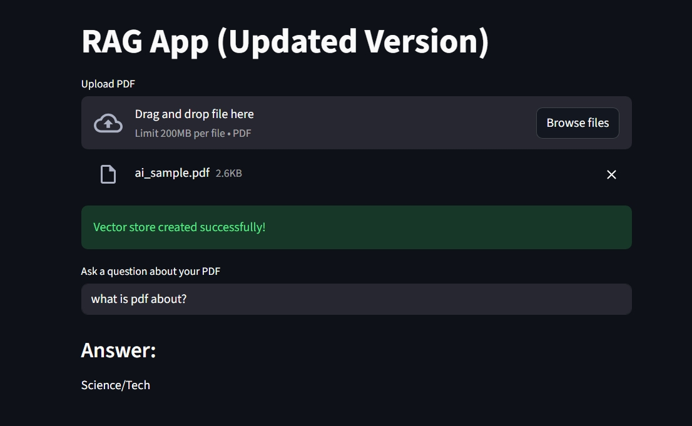

# RAG App (Retrieval-Augmented Generation)

A simple and modern RAG (Retrieval-Augmented Generation) application built with:
- Python
- Streamlit
- HuggingFace Embeddings
- FAISS Vector Store
- LangChain

This app lets you upload any PDF, convert it into chunks, store embeddings, and ask questions based on the PDF content.

## Features

- Upload any PDF and extract text instantly  
- Automatic chunking of text  
- Embedding generation using HuggingFace  
- FAISS vector store for fast similarity search  
- Ask questions and get answers based ONLY on your PDF  
- Simple UI built with Streamlit  
- Works locally — **No API key required**  

📦 Project Structure
rag-app/
│
├── app.py
├── main.py
├── requirements.txt
├── pyproject.toml
├── README.md
│
├── data/
│   └── ai_sample.pdf
│
└── utils/
    ├── loader.py
    ├── llm.py
    ├── embedding/
    │     └── embedding.py
    └── vector_store.py

    
    
🛠 Installation & Running Locally

1️⃣ Clone the repository
git clone https://github.com/bhavishraavi/rag-app.git
cd rag-app

2️⃣ Create virtual environment
python -m venv .venv
.\.venv\Scripts\activate     # Windows

3️⃣ Install dependencies
pip install -r requirements.txt

4️⃣ Run the app
streamlit run app.py

📚 How It Works

Upload a PDF

App loads and extracts text

Text is chunked and converted into vector embeddings

FAISS stores the vectors

When you ask a question → FAISS retrieves the best chunks

LLM (HuggingFace) produces an answer based ONLY on that PDF

🔒 No API Keys Needed

This version works 100% locally using HuggingFace Inference + FAISS.
You don’t need an OpenAI key, HuggingFace token, or internet to run inference.

👨‍💻 Author

Bhavish Raavi

GitHub: https://github.com/bhavishraavi

## App Screenshot
